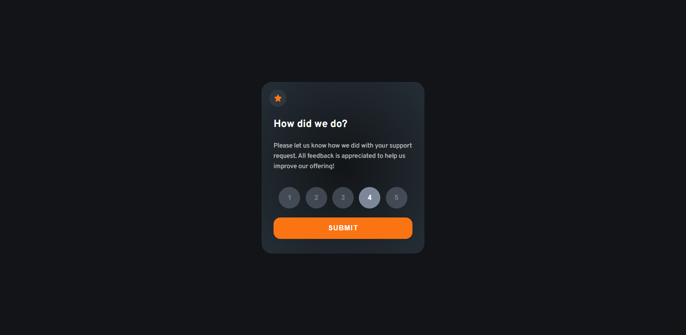

# Frontend Mentor - Interactive rating component solution

This is a solution to the [Interactive rating component challenge on Frontend Mentor](https://www.frontendmentor.io/challenges/interactive-rating-component-koxpeBUmI). Frontend Mentor challenges help you improve your coding skills by building realistic projects.

## Table of contents

- [Overview](#overview)
  - [The challenge](#the-challenge)
  - [Screenshot](#screenshot)
  - [Links](#links)
- [Author](#author)

## Overview

### The challenge

Users should be able to:

- View the optimal layout for the app depending on their device's screen size
- See hover states for all interactive elements on the page
- Select and submit a number rating
- See the "Thank you" card state after submitting a rating

### Screenshot

### Links

- Solution URL: [Add solution URL here](https://www.frontendmentor.io/solutions/interactiveratingcomponent-ByNKvYoN9)
- Live Site URL: [Add live site URL here](https://interactive-rating-component-frontend-mentor.vercel.app/)

## Author

- Website - [Mohamed Tansah](https://www.mohamedtanash.com)
- Frontend Mentor - [@Mtanash](https://www.frontendmentor.io/profile/Mtanash)
- Linkedin - [@Mohamed Tanash](https://www.linkedin.com/in/mohamed-tanash/)
